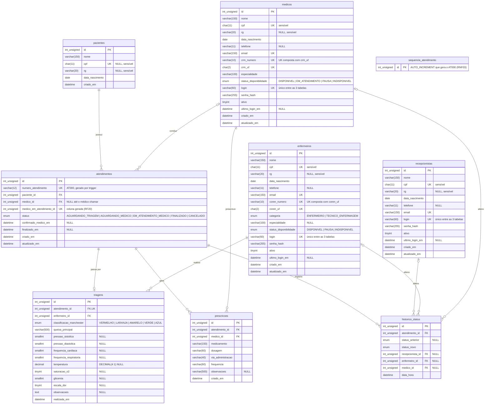

# DER — Diagrama Entidade-Relacionamento (lógico, MySQL)

Tabelas, colunas, chaves e cardinalidades como estão no banco.
Fonte: `src/db/001_schema_base.sql` + migrations `010`, `011` e `012`.
O modelo conceitual está em [MER.md](MER.md). Imagem: [img/DER.svg](img/DER.svg).

Recepcionistas, médicos e enfermeiros ficam em tabelas separadas, cada uma com o próprio `login` e `senha_hash`. Não existe tabela `usuarios`: o perfil de acesso é definido pela tabela onde o profissional está.

Notação pé-de-galinha: `||` exatamente um · `o|` zero ou um · `o{` zero ou muitos.

`sequencia_atendimento` não tem relacionamento: é uma tabela técnica. O trigger `trg_atendimentos_bi_numero` insere nela e usa `LAST_INSERT_ID()` para gerar o `numero_atendimento`.

## Chaves estrangeiras

Todas são `ON UPDATE RESTRICT ON DELETE RESTRICT`: nenhum registro clínico é apagado em cascata. Profissionais são desativados (`ativo = 0`), nunca excluídos.

| Tabela.coluna | → Referência | Nulo? | Único? |
|---|---|---|---|
| atendimentos.paciente_id | pacientes.id | não | não |
| atendimentos.medico_id | medicos.id | sim | não |
| triagens.atendimento_id | atendimentos.id | não | sim (1:1) |
| triagens.enfermeiro_id | enfermeiros.id | não | não |
| prescricoes.atendimento_id | atendimentos.id | não | não |
| prescricoes.medico_id | medicos.id | não | não |
| historico_status.atendimento_id | atendimentos.id | não | não |
| historico_status.recepcionista_id | recepcionistas.id | sim | não |
| historico_status.enfermeiro_id | enfermeiros.id | sim | não |
| historico_status.medico_id | medicos.id | sim | não |

Em `historico_status`, o CHECK `chk_historico_status_um_responsavel` exige que **exatamente uma** das três colunas de responsável esteja preenchida.

## Regras garantidas por trigger

| Trigger | Regra | Requisito |
|---|---|---|
| trg_atendimentos_bi_numero | Gera `AT000` único sob concorrência | RF02, RNF03 |
| trg_{recepcionistas,medicos,enfermeiros}_bi_login / _bu_login | Login não pode se repetir entre as três tabelas (procedure `sp_validar_login_unico`) | RNF08 |
| trg_atendimentos_bu_medico | Finalizado é imutável; não cancela após confirmação; médico responsável imutável e ativo | RF05, RF15, RNF05 |
| trg_triagens_bi_enfermeiro | Triagem só por ENFERMEIRO ativo e com atendimento AGUARDANDO_TRIAGEM | RNF04, RNF08 |
| trg_prescricoes_bi_medico / trg_prescricoes_bu_bloqueio | Prescrição só pelo médico responsável, com atendimento em curso; bloqueada após finalizar | RNF04, RF15 |
