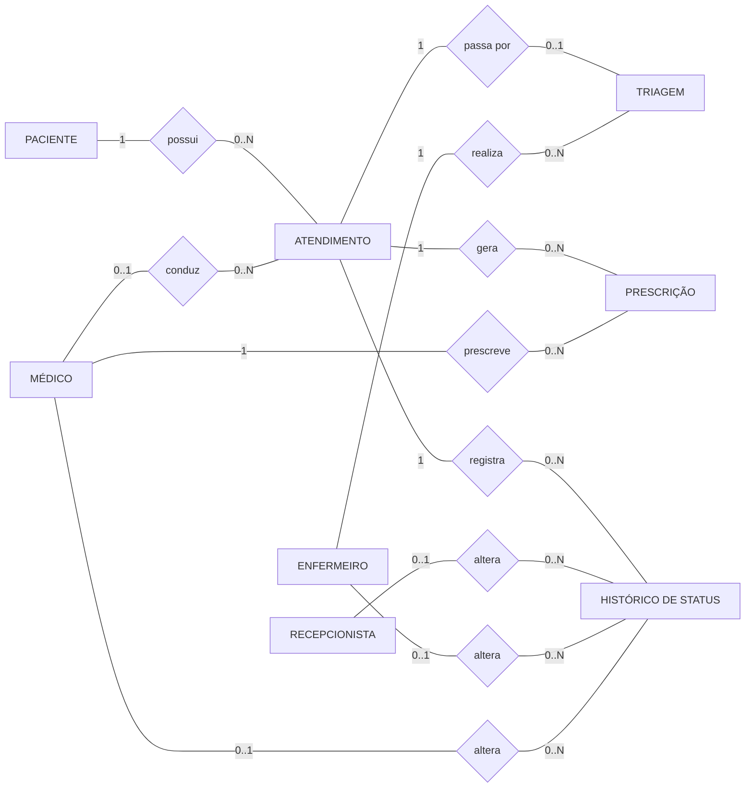
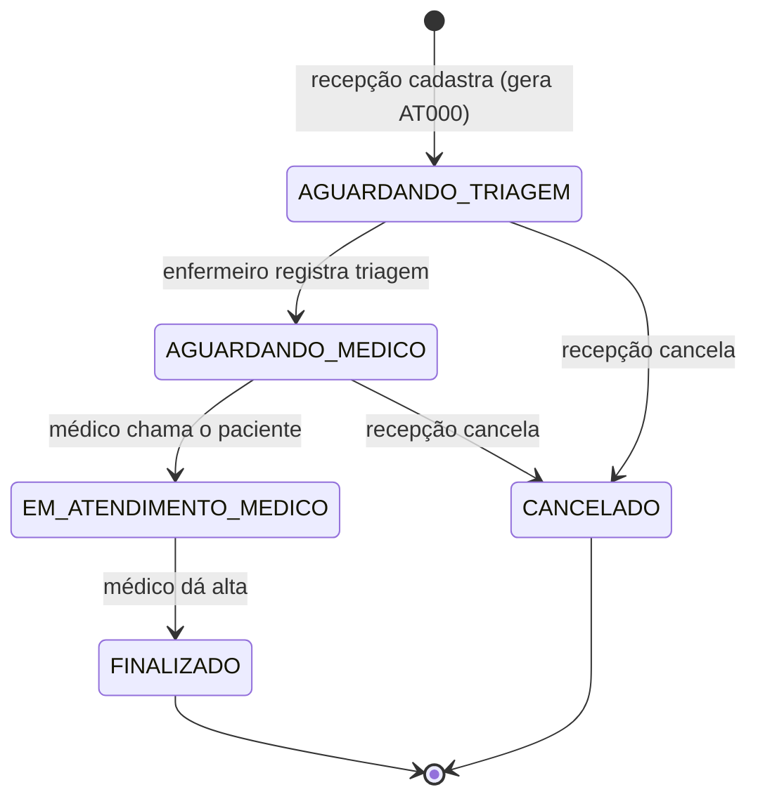

# MER — Modelo Entidade-Relacionamento (conceitual)

Sistema de Atendimento de Pronto-Socorro. Fluxo: **recepção → triagem → médico → alta**.

Fonte: `src/db/001_schema_base.sql` + migrations `010`, `011` e `012`.
O modelo lógico (tabelas, colunas, chaves) está em [DER.md](DER.md). Imagens: [img/MER.svg](img/MER.svg), [img/ciclo_atendimento.svg](img/ciclo_atendimento.svg).

## Diagrama (notação de Chen)

Retângulo = entidade · losango = relacionamento · rótulo da aresta = cardinalidade.

Recepcionistas, médicos e enfermeiros são entidades independentes, cada uma com o próprio login e senha. Não há entidade "usuário" compartilhada: o perfil de acesso é dado pela entidade em que o profissional está.

## Entidades e atributos

Legenda: **sublinhado** = identificador · *(s)* = dado sensível (RNF09) · *(opc)* = opcional.

| Entidade | Atributos |
|---|---|
| **Recepcionista** | <u>id</u>, nome, cpf *(s)*, rg *(s, opc)*, data_nascimento, telefone *(opc)*, email, login, senha_hash, ativo, ultimo_login_em |
| **Médico** | <u>id</u>, nome, cpf *(s)*, rg *(s, opc)*, data_nascimento, telefone *(opc)*, email, CRM (crm_numero + crm_uf, único), especialidade, status_disponibilidade {DISPONIVEL, EM_ATENDIMENTO, PAUSA, INDISPONIVEL}, login, senha_hash, ativo, ultimo_login_em |
| **Enfermeiro** | <u>id</u>, nome, cpf *(s)*, rg *(s, opc)*, data_nascimento, telefone *(opc)*, email, COREN (coren_numero + coren_uf, único), categoria {ENFERMEIRO, TECNICO_ENFERMAGEM}, especialidade *(opc)*, status_disponibilidade {DISPONIVEL, PAUSA, INDISPONIVEL}, login, senha_hash, ativo, ultimo_login_em |

O `login` é único dentro de cada entidade e também entre as três (não existem dois profissionais com o mesmo login).

| Entidade | Atributos |
|---|---|
| **Paciente** | <u>id</u>, nome, cpf *(s, único)*, rg *(s)*, data_nascimento, criado_em |
| **Atendimento** | <u>id</u>, numero_atendimento (AT000, único), status {AGUARDANDO_TRIAGEM, AGUARDANDO_MEDICO, EM_ATENDIMENTO_MEDICO, FINALIZADO, CANCELADO}, confirmado_medico_em, finalizado_em, criado_em, atualizado_em |
| **Triagem** | <u>id</u>, classificacao_manchester {VERMELHO, LARANJA, AMARELO, VERDE, AZUL}, queixa_principal, pressão (sistólica/diastólica), frequencia_cardiaca, frequencia_respiratoria, temperatura, saturacao_o2, glicemia, escala_dor, observacoes, realizada_em |
| **Prescrição** | <u>id</u>, medicamento, dosagem, via_administracao, frequencia, observacoes *(opc)*, criado_em |
| **Histórico de Status** | <u>id</u>, status_anterior *(opc)*, status_novo, data_hora |

## Relacionamentos

| Relacionamento | Entidades | Cardinalidade | Regra |
|---|---|---|---|
| possui | Paciente — Atendimento | 1 : 0..N | Um paciente pode voltar ao PS várias vezes; cada atendimento é de um único paciente. |
| conduz | Médico — Atendimento | 0..1 : 0..N | Vazio até o médico chamar o paciente; depois é obrigatório e imutável (RF19). Um médico conduz no máximo **1** atendimento EM_ATENDIMENTO_MEDICO por vez (RF20). |
| passa por | Atendimento — Triagem | 1 : 0..1 | Triagem única por atendimento e nunca existe sem ele (RNF04). |
| realiza | Enfermeiro — Triagem | 1 : 0..N | Só enfermeiro ativo da categoria ENFERMEIRO registra triagem (RNF08). |
| gera | Atendimento — Prescrição | 1 : 0..N | Uma linha por medicamento; nunca existe sem atendimento (RNF04). |
| prescreve | Médico — Prescrição | 1 : 0..N | Só o médico responsável pelo atendimento prescreve (RF21). |
| registra | Atendimento — Histórico | 1 : 0..N | Uma linha por mudança de status (RF14). |
| altera | Recepcionista / Enfermeiro / Médico — Histórico | 0..1 : 0..N (cada) | Quem fez a mudança de status (auditoria). Cada registro tem **exatamente um** responsável, de uma das três entidades. |

## Ciclo de vida do Atendimento

A partir da confirmação médica o atendimento não pode ser alterado nem cancelado (RF04, RF05, RNF05). Depois de FINALIZADO, é imutável (RF15).
